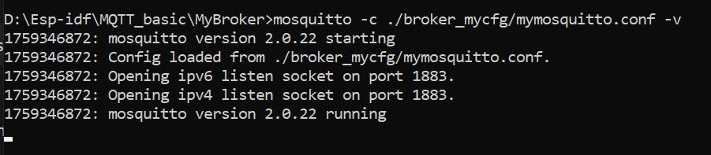
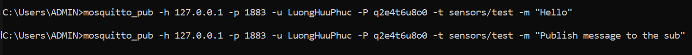
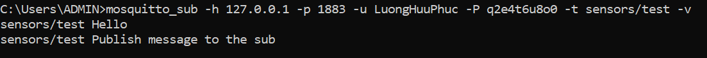

- Địa chỉ `127.0.0.1` là địa chỉ loopback (hay còn gọi là localhost)
- Nó dùng cho một thiết bị/máy tính kết nối tới chính nó thông qua giao thức TCP/IP
- Trong MQTT, dùng khi client và broker cùng nằm trên 1 máy (khi muốn test trên chính máy đó)
- Nếu client ở máy khác (có thể là ESP32), thì client đó phải dùng IP thật trong mạng LAN/WAN của máy chạy broker (máy tính của bạn chẳng hạn)

### TEST VỚI MÁY TÍNH ###
- Kết nối máy tính với broker của chính nó
- Mở cổng port broker (1883) trên máy bạn với lệnh
```bash
mosquitto -c ./broker_mycfg/mymosquitto.conf -v 

# -c <file>: Dùng chỉ định file cấu hình khi khởi động broker (thay vì dùng file mosquitto.conf mặc định)
# -v: In ra log màn hình (verbose). Hữu ích khi debug
# -p <port>: Chạy broker với cổng TCP cụ thể (mặc định là 1883 cho MQTT và 8883 cho MQTTs)
# -h: Hiển thị màn hình hỗ trợ
# -q: Chế độ quiet, hạn chế log
# -i <id>: Đặt Client ID cho broker khi cần (ít dùng)
```






### TEST VỚI ESP32 ###
